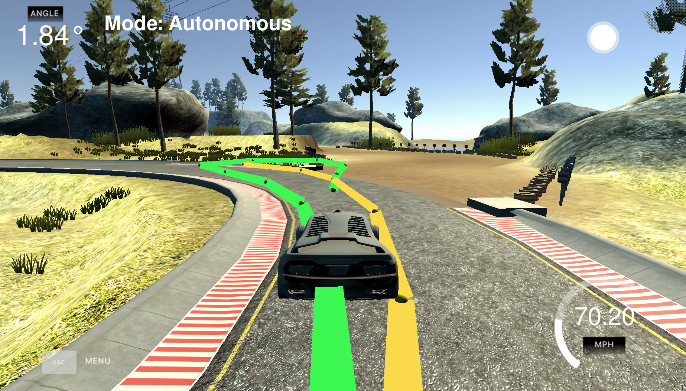
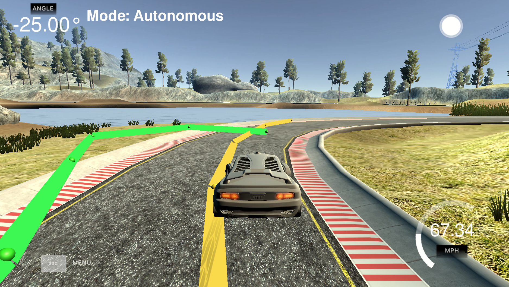
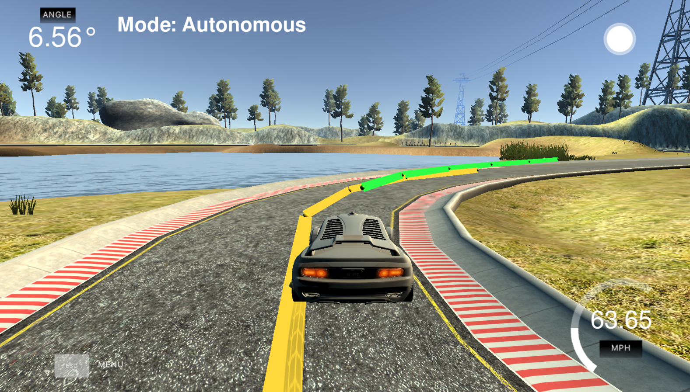

# CarND-Controls-MPC
Self-Driving Car Engineer Nanodegree Program

---

# The Model

## Structure

My model is structured as followed:

1. Once a measurement $[x ,y , \psi, v]$ comes, I convert (x, y) coordinates from global (map) Coordinate system to the local (vehicle) coordinate system, using `convert_to_vehicle_system(...)` free function (main.cpp, lines 24-35) .

2. Then I typecast std::vector to Eigen::VectorXd and fit the waypoints to a 3rd grade polynomial (main.cpp, line 104) and evaluate the resulted coefficients (main.cpp, line 110).

3. I use the result of the  polynomial fitting and it's evaluation to calculate CrossTrackError and $e \psi$. Current state (measurement from step 1) and these values are then used to calculate the next_state per measurement using free function `compute_next_state(...)` (main.cpp).

4. `compute_next_state(...)` : since we're in the vehicle coordinate system, where vehicle position (x, y, psi) = (0, 0, 0), I override these values accordingly and calculate the new state using equations:

   $x_{t+1} = x_t + v_t cos(\psi_t) * dt$
   $y_{t+1} = y_t + v_t sin(\psi_t) * dt$
   $\psi_{t+1} = \psi_t - \frac {v_t} { L_f} \delta_t * dt$	Here it is important to mention, that I use subtraction instead of addition due to the simulation environment
   $v_{t+1} = v_t + a_t * dt$
   $cte_{t+1} = f(x_t) - y_t + (v_t sin(e\psi_t) dt)$
   $e\psi_{t+1} = \psi_t - \psi{des}_t + (\frac{v_t} { L_f} \delta_t dt)$

5. Then the new state is used in Solve(...) member function of the Model Predictive Control (MPD.cpp, lines 139 -  268)

6. `MPC::Solve()` : Essentially, here I create a large vector of the size 6 * 25+2 * 24 = 198, where

   vars[0], ..., vars[24] -> $x_1, ..., x_{25}$

   vars[25], ..., vars[49] -> $y_1, ..., y_{25}$

   vars[50], ..., vars[74] -> $\psi_1, ..., \psi_{25}$

   vars[75], ..., vars[99] -> $v_1, ..., v_{25}$

   vars[100], ..., vars[124] -> $cte_1, ..., cte_{25}$

   vars[125], ..., vars[149] -> $e\psi_1, ..., e\psi_{25}$

   vars[150], ..., vars[173] -> $\delta_1, ..., \delta_{24}$

   vars[174], ..., vars[197] -> $a_1, ..., a_{24}$

   which I fill only with the new state, I've passed for $x_0, y_0, \psi_0, v_0, cte_0, e\psi_0$ 

   I construct a vector vars_lowerbound ofconstraints for the delta of the steer angle (+-1.0e19), steer ange (+-25 degrees) and Acceleration (+-1).

   I costruct 2 more vectors for constraints_lowerbound and constraints_upperbound which essentially hold the same values as my input state

7. I initialize an object `fg_eval(coeffs)` (MPC.cpp, line 222) and string of options for further use in CppAD::ipopt::solve to calculate the optimal trajectory, using the waypoints and the constraints.

8. `operator()` member function of the `FG_eval` class: it's vector fg at position [0] always holds the costs for the current trajectory. So I calculate this total costs by summing up the costs based on:

   1. reference state (CTE, $e\psi$, $v$) and their multiplicators (verbose description in the [Parameters](#Parameters) section) in lines 28-37 of the MPC.cpp. smooth transition to the reference track.
   2. actuator parameters (delta of the steering angle and acceleration) and their multiplicators (verbose description in the [Parameters](#Parameters) section) in lines 46-49 of the MPC.cpp. This allows smooth behavior in curves.
   3. Deltas between the accelerations and steering angles between $t$ and $t+1& timestamps and their multiplicators (verbose description in the [Parameters](#Parameters) section) in lines 53-57 of the MPC.cpp. This allows smooth transition between actuator steps.
   4. I copy/paste the constraints for the state in lines 69-74, which are the values from my input state vector.
   5. Finally I calculate the new waypoints for the new N positions in a loop in lines 123-129 of the MPC.cpp with all given and pre-calculated values.

   What is important, that for steering angle delta and the acceleration, I use the values not from the previous state, but from 2 states behind. That eliminates the shakiness at higher speeds, which is introduced by the latency. (MPC.cpp, lines 97 - 105).

9. The `MPC::Solve()`  returns with the vector of values:

   * [0] steer angle change
   * [1] acceleration (throttle)
   * [2 - N*2] one after another, x & y values of the correction trajectory.

   which are then used for the actuator and visualization of the actual vehicle trajectory mpc_x_vals (green line).

## Parameters

Timestep Length and Elapsed Duration (N & dt) are chosen to be 7 and 0.1 correspondingly.

The choice of Timestep length is described in section [Limitations (issues)](#Limitations (issues)). 

Nonetheless, also following bundle of values worked fine for me:

```c++
const size_t N = 25;
const double DT = 0.1;
const double REF_V = 80;
double const STEER_DIFF_COST = 500.0;
```

The Elapsed duration of 0.1 is chosen as a trade-off between performance optimization of the solver on the one hand and the length of the horizon on the other hand.

The final set of the parameters is collected in `MPC.h`, lines 17-32:

```c++
const double Lf = 2.67;
const size_t N = 7;
const double DT = 0.1;
const double REF_V = 70;
const double CTE_COST = 50.0;
const double EPSI_COST = 50.0;
const double SPEED_COST = 1.0;
const double STEER_COST = 20000.0;
const double ACCELERATION_COST = 0.05;
const double STEER_DIFF_COST = 200.0;
const double ACCELERATION_DIFF_COST = 1.0;
```

Parameter tuning was one the most time-consuming tasks of this project.

Here the vehicle reference speed is set to 70 mph to avoid unwanted problems due to latency and performance bottlenecks. However, 80mph works also well.

I even managed to drive with 90mph using following parameters' set:

```c++
const size_t N = 10;
const double REF_V = 90;
double const STEER_DIFF_COST = 500.0;
```

### Limitations (issues)

During parameter tuning, while having `const size_t N = 15+;`  I've noticed one weird issue, where visualization helped me a lot:





The issue is, that obviously the polynomial fitting and calculation of the vehicle trajectory in the curves takes too much time, the waypoints are not being updated by the simulation on time, so the vehicle reaches the end of the reference trajectory very fast and in the next step the trajectory calculation of the `CppAD::ipopt::solve(...)` navigates us back to the known waypoints.

**Solution**: Setting `const size_t N = 7` solves the issue completely. This results in the smooth curve with an approppriate speed:




# Auxiliary

## Dependencies

* cmake >= 3.5
 * All OSes: [click here for installation instructions](https://cmake.org/install/)
* make >= 4.1(mac, linux), 3.81(Windows)
  * Linux: make is installed by default on most Linux distros
  * Mac: [install Xcode command line tools to get make](https://developer.apple.com/xcode/features/)
  * Windows: [Click here for installation instructions](http://gnuwin32.sourceforge.net/packages/make.htm)
* gcc/g++ >= 5.4
  * Linux: gcc / g++ is installed by default on most Linux distros
  * Mac: same deal as make - [install Xcode command line tools]((https://developer.apple.com/xcode/features/)
  * Windows: recommend using [MinGW](http://www.mingw.org/)
* [uWebSockets](https://github.com/uWebSockets/uWebSockets)
  * Run either `install-mac.sh` or `install-ubuntu.sh`.
  * If you install from source, checkout to commit `e94b6e1`, i.e.
    ```
    git clone https://github.com/uWebSockets/uWebSockets
    cd uWebSockets
    git checkout e94b6e1
    ```
    Some function signatures have changed in v0.14.x. See [this PR](https://github.com/udacity/CarND-MPC-Project/pull/3) for more details.

* **Ipopt and CppAD:** Please refer to [this document](https://github.com/udacity/CarND-MPC-Project/blob/master/install_Ipopt_CppAD.md) for installation instructions.
* [Eigen](http://eigen.tuxfamily.org/index.php?title=Main_Page). This is already part of the repo so you shouldn't have to worry about it.
* Simulator. You can download these from the [releases tab](https://github.com/udacity/self-driving-car-sim/releases).
* Not a dependency but read the [DATA.md](./DATA.md) for a description of the data sent back from the simulator.


## Basic Build Instructions

1. Clone this repo.
2. Make a build directory: `mkdir build && cd build`
3. Compile: `cmake .. && make`
4. Run it: `./mpc`.

## Build with Docker-Compose
The docker-compose can run the project into a container
and exposes the port required by the simulator to run.

1. Clone this repo.
2. Build image: `docker-compose build`
3. Run Container: `docker-compose up`
4. On code changes repeat steps 2 and 3.

## Tips

1. The MPC is recommended to be tested on examples to see if implementation behaves as desired. One possible example
is the vehicle offset of a straight line (reference). If the MPC implementation is correct, it tracks the reference line after some timesteps(not too many).
2. The `lake_track_waypoints.csv` file has waypoints of the lake track. This could fit polynomials and points and see of how well your model tracks curve. NOTE: This file might be not completely in sync with the simulator so your solution should NOT depend on it.
3. For visualization this C++ [matplotlib wrapper](https://github.com/lava/matplotlib-cpp) could be helpful.)
4.  Tips for setting up your environment are available [here](https://classroom.udacity.com/nanodegrees/nd013/parts/40f38239-66b6-46ec-ae68-03afd8a601c8/modules/0949fca6-b379-42af-a919-ee50aa304e6a/lessons/f758c44c-5e40-4e01-93b5-1a82aa4e044f/concepts/23d376c7-0195-4276-bdf0-e02f1f3c665d)
5. **VM Latency:** Some students have reported differences in behavior using VM's ostensibly a result of latency.  Please let us know if issues arise as a result of a VM environment.

## Editor Settings

We have kept editor configuration files out of this repo to
keep it as simple and environment agnostic as possible. However, we recommend
using the following settings:

* indent using spaces
* set tab width to 2 spaces (keeps the matrices in source code aligned)

## Code Style

Please (do your best to) stick to [Google's C++ style guide](https://google.github.io/styleguide/cppguide.html).

## Project Instructions and Rubric

Note: regardless of the changes you make, your project must be buildable using
cmake and make!

More information is only accessible by people who are already enrolled in Term 2
of CarND. If you are enrolled, see [the project page](https://classroom.udacity.com/nanodegrees/nd013/parts/40f38239-66b6-46ec-ae68-03afd8a601c8/modules/f1820894-8322-4bb3-81aa-b26b3c6dcbaf/lessons/b1ff3be0-c904-438e-aad3-2b5379f0e0c3/concepts/1a2255a0-e23c-44cf-8d41-39b8a3c8264a)
for instructions and the project rubric.

## Hints!

* You don't have to follow this directory structure, but if you do, your work
  will span all of the .cpp files here. Keep an eye out for TODOs.

## Call for IDE Profiles Pull Requests

Help your fellow students!

We decided to create Makefiles with cmake to keep this project as platform
agnostic as possible. We omitted IDE profiles to ensure
students don't feel pressured to use one IDE or another.

However! I'd love to help people get up and running with their IDEs of choice.
If you've created a profile for an IDE you think other students would
appreciate, we'd love to have you add the requisite profile files and
instructions to ide_profiles/. For example if you wanted to add a VS Code
profile, you'd add:

* /ide_profiles/vscode/.vscode
* /ide_profiles/vscode/README.md

The README should explain what the profile does, how to take advantage of it,
and how to install it.

Frankly, I've never been involved in a project with multiple IDE profiles
before. I believe the best way to handle this would be to keep them out of the
repo root to avoid clutter. Most profiles will include
instructions to copy files to a new location to get picked up by the IDE, but
that's just a guess.

One last note here: regardless of the IDE used, every submitted project must
still be compilable with cmake and make./

## How to write a README
A well written README file can enhance your project and portfolio and develop your abilities to create professional README files by completing [this free course](https://www.udacity.com/course/writing-readmes--ud777).
